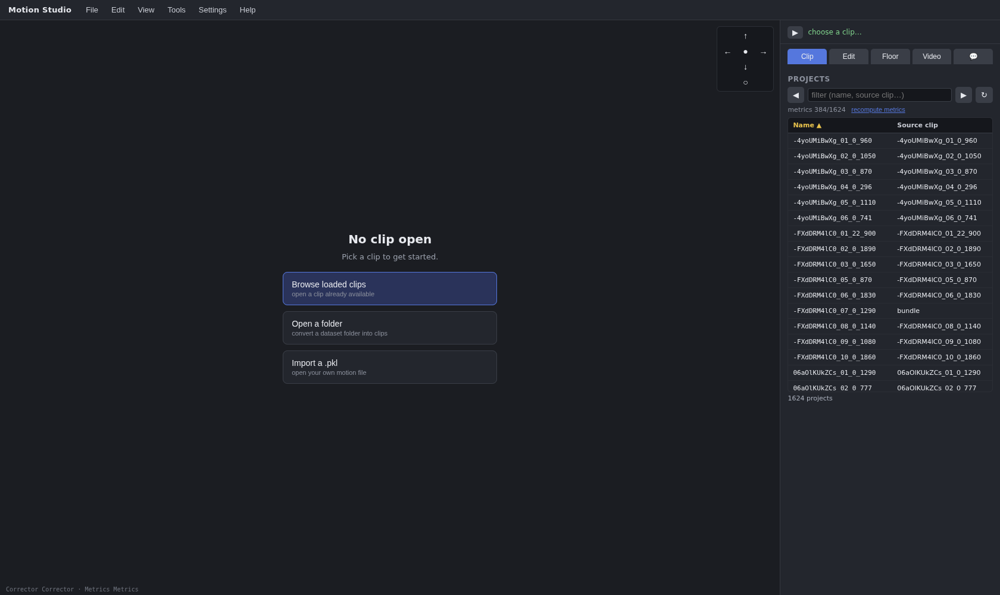
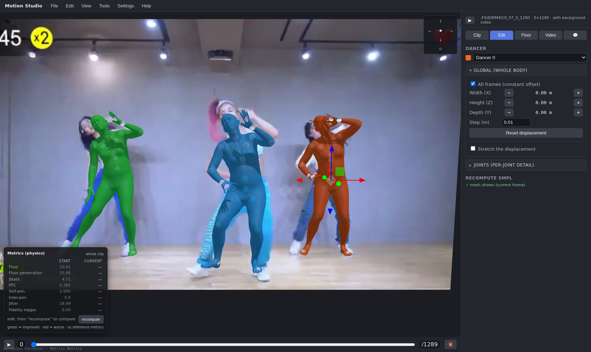
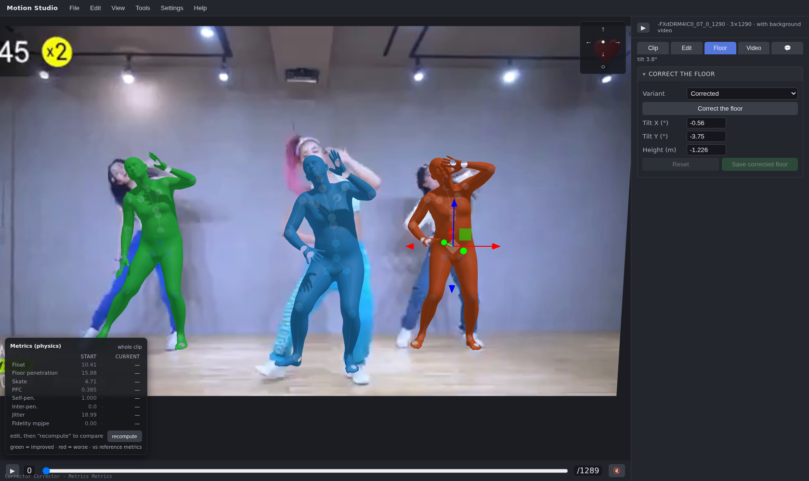
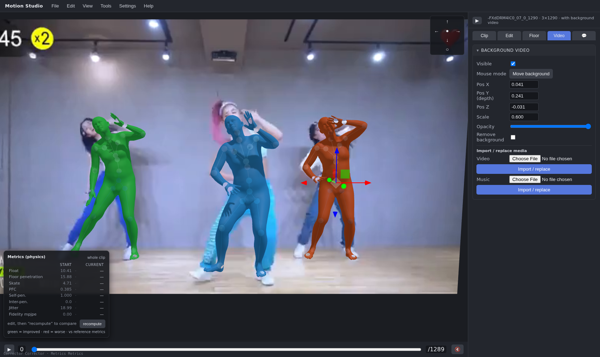

# Motion Studio — User Guide

A complete walkthrough of the editor, from launching it to exporting a corrected
motion. (Screenshots are from the live tool; the default UI language is English,
with French and 中文 available from the top-right selector.)

## 1. Launch

```bash
motion-studio --port 8815
# optionally point at your own plugins:
motion-studio --corrector ./my.py:MyCorrector --metrics ./my.py:MyMetrics
```

Open <http://127.0.0.1:8815>. The data directories (SMPL `.pkl` motions,
background videos, music) and the SMPL model directory are set from the UI
("Data source" / settings) and persisted to `workspace/config.json`, so a bare
relaunch reuses them. The **workspace** is the folder that stores your saved
`.motion` sessions, like any app keeps its documents.

When a real (non-default) **metrics** plugin is configured, the server computes
and caches each bundle's reference metrics in the background after launch, so the
library becomes sortable by metric.

## 2. Empty start — open a clip

On startup the editor is **empty**: no clip is auto-loaded and no pop-up opens.



From the **File** menu (top bar) you have three coherent ways to open a clip:

- **Load a project** — pick from the `.motion` sessions already in your
  workspace, listed in the sortable **Projects** browser (filter by name, sort
  by any metric, step through with the ◀ ▶ arrows).
- **Load a file** — pick a `<clip>.pkl` from your configured `pkl_dir/`; its
  video (`videos_dir/<clip>.mp4`) and music (`audio_dir/<clip>.wav|mp3`) are
  matched by exact name, and the clip is converted to a `.motion` and opened.
- **Load a folder** — point at your data directories (a flat `pkl_dir/`, plus
  optional `videos_dir/` and `audio_dir/`); every clip is converted into a
  `.motion` bundle in the workspace as a background job with a progress bar.

When a real metrics plugin is configured, each clip's reference metrics are
computed on open (and warmed in the background for the whole library) so the
Projects list is sortable by metric.

## 3. Edit the motion



- The scene shows every dancer as a **skeleton** and/or **mesh** (toggles in the
  **View** menu), plus a **ghost** of the original motion for before/after
  comparison.
- **Global (whole body)**: nudge a dancer along X / Z / Y (depth), for one frame
  or all frames; or **stretch** the trajectory between key positions.
- **Joints (per-joint detail)**: select a joint and edit its rotation.
- **Recompute SMPL**: refit the SMPL mesh to your edited joints (current frame
  or all).
- Full **undo / redo**.

## 4. Automatic corrector & metrics

In the **Tools** menu, **Correct the motion (Corrector class)** runs the
auto-correction pipeline — from the raw original, or from your current edits.
The result comes back as a *pending* edit (nothing is overwritten) with updated
metrics. Both the corrector and the metrics are **plugins** (see the main
README): you can point the tool at your own classes.

The bottom-left **Metrics** panel shows reference vs. current values
(penetration, float, skate, PFC, jitter, …).

## 5. Floor



The ground plane is **estimated on load** and drawn in the scene. In the
**Floor** tab you can switch variants, edit the plane by hand, or recompute it.
Floor estimation is a plugin (`MotionFloor`): the bundled default is a generic
lowest-foot-points RANSAC fit — point `--floor <module-or-path>:<Class>` at your
own estimator for anything more sophisticated (see [PLUGINS.md](PLUGINS.md)).

## 6. Video & music background



In the **Video** tab, place the source video in the scene (position, scale,
opacity), nudge its **time offset** until it matches the dancers, and optionally
**remove its background** (server-side person segmentation). Music plays in sync
with the timeline. You can also **import / replace** the video or the music of
the open clip at any time.

## 7. Save & export

- **Save (.motion)** (or Ctrl+S) writes the whole session — original motion,
  your edits, the video, the music, the placement parameters, the comments and a
  metrics snapshot — into a single `.motion` file in your workspace. Reopen it
  later to continue exactly where you left off.
- **Export (.pkl)** (Ctrl+Shift+S) downloads just the corrected SMPL motion as an
  AIOZ `.pkl`. This is the only action that writes a `.pkl`.

## 8. Comments

The 💬 tab keeps per-clip notes (with your name), saved inside the `.motion`
bundle.

---

See the [README](../README.md) for installation and the plugin contract.
